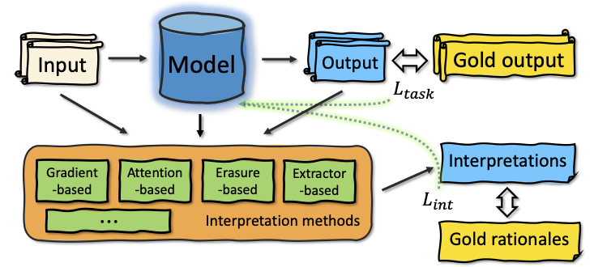

# Using Interpretation Methods for Model Enhancement (UIMER)
Source code of the EMNLP2023 paper "Using Interpretation Methods for Model Enhancement", Zhuo Chen, Chengyue Jiang and Kewei Tu. Code implemented based on [JointBERT](https://github.com/monologg/JointBERT)



## Requirements
```
pip install -r requirements.txt
```
## Data
1. Download [data.tar.gz](https://drive.google.com/file/d/1NggK7r44enD3JYHVdc8X68h_QbJ-ifQk/view?usp=sharing) to UIMER/
2. ```tar -xf data.tar.gz```

## Training

### UIMER-IM

__Importance args__

- --sub_task: intent/slot
- --replace: (Sec. 3.2.1, replace strategy) args mapping:
    | Strategy | args |
    |----|----|
    | BERT | bert |
    | Prior | frequency |
    | Uniform | random |
    | MASK | mask |
- --replace_repeat: size of $S^R(S^N)$
- --weight: $\alpha$ (when 'replace' is not none)
- --margin: $\epsilon$
- --warmup_epoch: number of warmup training on $L
_{task}$ discussed in Sec. 5.1.
- --grad: Use [Ghaeini et al. (2019)](https://arxiv.org/pdf/1902.08649.pdf)'s method (1) or not (0)
- --grad_weight: $\alpha$ (when 'grad' is not 0)
- --feng: Use [Huang et al. (2021)](https://aclanthology.org/2021.acl-long.433.pdf)'s method (base/order/gate/gate+order) or not (none).
- --feng_weight $\alpha$ (when 'feng' is not none)

E.g. for method UIMER-IM on intent classification task in 5-shot setting over 4 random seeds.

```python
python main.py --seed 55:1988:12333:42 \
  --learning_rate 0.001 \
  --train_batch_size 24 \
  --task snips \
  --model_type bert \
  --model_dir snips_model \
  --do_train \
  --do_eval \
  --use_crf \
  --logging_step 1 \
  --log_path ./{LOG_PATH} \
  --sub_task intent \
  --shot 5 \
  --replace frequency \
  --replace_repeat 2 \
  --weight 0.5 \
  --margin 1 \
  --warmup_epoch 0 \
  --grad 0 \
  --grad_weight 0.0 \
  --feng none \
  --feng_weight 0.0 \
  --lower_bound 1e-23 \
  --max_rationale_percentage 0.3 \
  --verbose 0 \
  --early_stop 10 \
  --case_study_dir ""
```

### UIMER-DM
UIMER-DM methods first needs a well-trained model($\theta$) to train the extractor($\phi$) as discussed in our paper, the last paragraph in Sec. 2.1.

__important keyworks__

- --lr_extractor: learning rate to train $\phi$
- --num_train_epochs: number of epochs training $\theta$ in each round
- --num_train_extractor_epochs number of epochs training $\phiß$ in each round
- --total_round: number of rounds of training $\theta$ and $\phi$.
- --re_init_extractor: Choose to re-initialize the extractor at the beginning of each round. Default to 0.
- --weight_extractor: $\alpha$
- --gate: input/hidden. Options used to train extractor($\phi$). Details in [De Cao et al., 2020](https://aclanthology.org/2020.emnlp-main.262.pdf).
- --load_model: whether we have a well-trained model for training extractor first. Default to 0.

E.g. for method UIMER-DM on slot filling task in 10-shot setting over 4 random seeds.

``` python
python main_extractor.py --seed 55:1988:12333:42 \
  --learning_rate 0.0001 \
  --lr_extractor 0.0001 \
  --lr_decay 0.99 \
  --num_train_epochs 1 \
  --num_train_extractor_epochs 1 \
  --total_round 100 \
  --re_init_extractor 0 \
  --train_batch_size 24 \
  --task snips \
  --model_type bert \
  --do_train \
  --use_crf \
  --logging_step 1 \
  --log_path ./{LOG_PATH} \
  --sub_task slot \
  --shot 10 \
  --weight_extractor 10 \
  --gate input \
  --loss_func_rationale margin \
  --max_rationale_percentage 0.3 \
  --load_model 0 \
  --verbose 0 \
  --early_stop 10
```

## Citation
@inproceedings{ <br>
chen2023using, <br>
title={Using Interpretation Methods for Model Enhancement}, <br>
author={Zhuo Chen and Chengyue Jiang and Kewei Tu}, <br>
booktitle={The 2023 Conference on Empirical Methods in Natural Language Processing}, <br>
year={2023}, <br>
url={https://openreview.net/forum?id=xMudYCcBum} <br>
}

## Note 
Please be careful of the version of your CUDA (should be compatible with torch). E.g., the code might not be able to run on some graphics card like A40.
